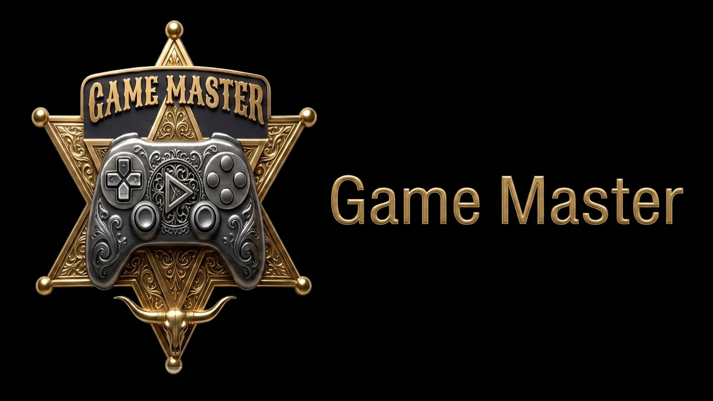

# Game Master

<p align="center">
  
</p>

**Game Master** is a 2D and 3D game engine with its own name, mark and
platform icons. Everything a game needs is here: a feature-packed editor, one-click
export to desktop (Linux, macOS, Windows), mobile (Android, iOS) and the Web.

The engine code is a personal fork of the MIT-licensed
[Godot Engine](https://godotengine.org) sources. File formats (`project.godot`,
the `.godot/` folder) and C++ identifiers stay compatible so existing projects
and add-ons keep working. What you see in the editor, the installer, the splash
and the app icon is Game Master.

## Brand

The public mark is the gold sheriff-star badge with a controller, plus the
**GAME MASTER** wordmark. Source artwork lives in `misc/logo/`. Every other size
(Android adaptive layers, iOS, PWA, Windows `.ico`, macOS `.icns`, Linux hicolor,
editor title-bar and About logos) is generated from that:

```console
./misc/scripts/game_master_assets.py             # full kit (needs: pip install pillow numpy)
./misc/scripts/game_master_assets.py --svg-only  # editor + dist vector marks
./misc/scripts/game_master_assets.py --check     # fail if a Godot robot/wordmark sneaks back in
```

`misc/brand/` is the per-platform kit to point export presets at — see
`misc/brand/README.md`.

## Building

There are no published binaries for this fork yet; build from source:

```console
scons platform=linuxbsd target=editor
```

Compilation instructions for every supported platform are in the
[upstream compiling docs](https://docs.godotengine.org/en/latest/engine_details/development/compiling).
The resulting binary is still named `godot` so existing scripts keep working:
`./bin/godot.linuxbsd.editor.x86_64`.

## License

MIT (`LICENSE.txt`). Original authors: [Juan Linietsky](https://github.com/reduz)
and [Ariel Manzur](https://github.com/punto-). See `AUTHORS.md` and `DONORS.md`.
The Game Master mark is original to this fork and is not the Godot Engine logo.
